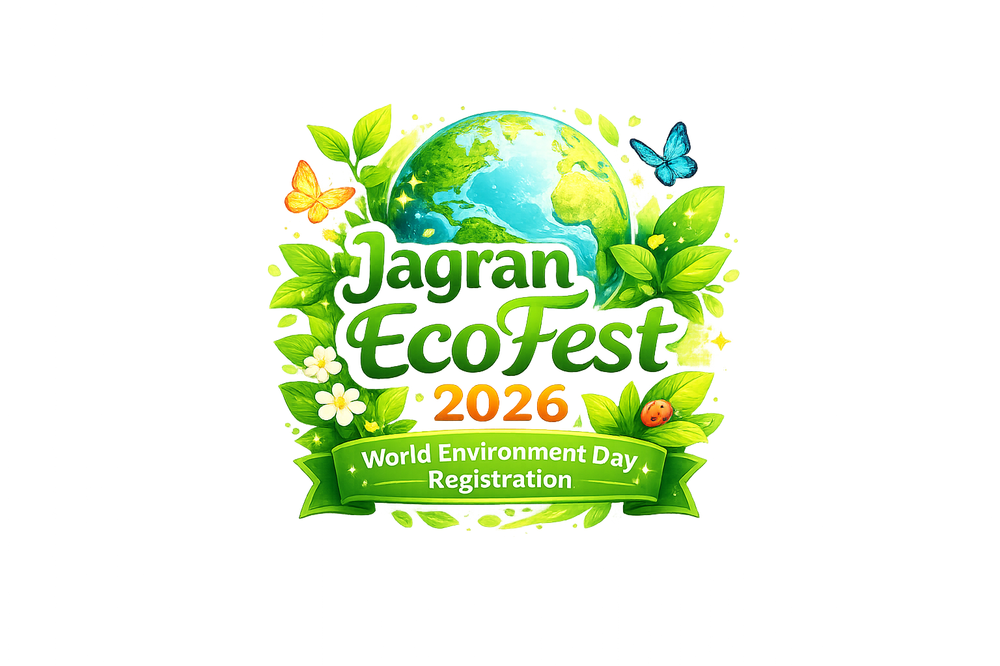
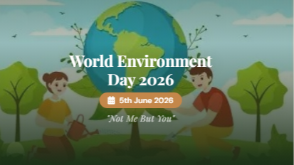
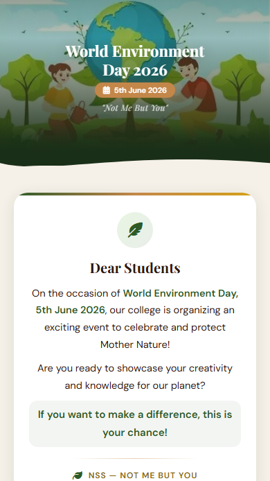

<div align="center">


<br><br>

<!-- Typing animation -->
<a href="https://git.io/typing-svg">
  
</a>

### A Multi-Step Event Registration Web App by NSS Unit

<p align="center">
  <strong>
    Mobile-first registration platform for World Environment Day 2026 at Jagran College —
    featuring Poster & Slogan Making, Quiz Competition, team management,
    Google Sheets backend, and a full Admin Dashboard.
  </strong>
</p>

<!-- CTA Buttons -->
### 🚀 [✨ Register Now ✨](https://www.jagranecofest.free.nf/)

<p align="center">
  <a href="https://www.jagranecofest.free.nf/admin" target="_blank">
    
  </a>
</p>

<br/>

<!-- Preview Image -->
<a href="https://www.jagranecofest.free.nf/">
  
</a>

<br/>

<p align="center">
  <a href="#-features">Features</a> •
  <a href="#-screens">Screens</a> •
  <a href="#-screenshots">Screenshots</a> •
  <a href="#-quick-start">Quick Start</a> •
  <a href="https://www.jagranecofest.free.nf/">Live Demo</a>
</p>

<!-- Divider wave -->


> ### *"Not Me But You"* — NSS Motto 🌿


</div>

<br/>

## 📖 Table of Contents

- [✨ About The Project](#-about-the-project)
- [🎬 Features](#-features)
- [📱 Screens](#-screens)
- [🖥️ Screenshots](#️-screenshots)
- [🛠️ Tech Stack](#️-tech-stack)
- [⚡ Quick Start](#-quick-start)
- [📁 Project Structure](#-project-structure)
- [⚙️ Google Apps Script Setup](#️-google-apps-script-setup)
- [🔐 Admin Panel](#-admin-panel)
- [📲 Distribution](#-distribution)
- [♿ Accessibility](#-accessibility)
- [🤝 Contributing](#-contributing)
- [📜 License](#-license)

<br/>

---

## ✨ About The Project

**JagranEcoFest** is a mobile-first, multi-step event registration web application built for **World Environment Day 2026** (5th June) at Jagran College of Arts, Science and Commerce.

Students can register for a **Poster & Slogan Making Competition**, a **Quiz Competition**, or **both** — through an intuitive, nature-themed interface with smooth Anime.js transitions, floating leaf animations, and cinematic screen flows.

All registrations are automatically stored in **Google Sheets** via Google Apps Script, with an **Admin Dashboard** for the NSS Teacher (Kanika Mam) to view, search, filter, analyze, export (CSV/PDF), and manage all entries.

Built entirely with **vanilla HTML, CSS & JavaScript** — no frameworks, no build step, just pure front-end magic connected to a serverless Google backend.

<br/>

---

## 🎬 Features

<table>
<tr>
<td width="50%">

### 🌿 Student Registration
- 📱 **Mobile-first** — optimized for WhatsApp sharing
- 🔄 **Multi-step flow** — 4 guided screens
- 🎨 **Poster & Slogan Making** — individual entry
- 🧠 **Quiz Competition** — team of 2-3 members
- ⭐ **Both Competitions** — register for both at once
- 🔍 **Duplicate detection** — checks before submitting

</td>
<td width="50%">

### 📊 Admin Dashboard
- 🔒 **Password-protected** login gate
- 📈 **Stats cards** — total, poster, quiz, teams, today
- 📉 **Trend chart** — 14-day registration graph
- 🔎 **Search & filter** — by name, batch, competition
- 📄 **Export** — CSV download + PDF (2 cards/A4)
- 🗑️ **Delete entries** — with confirmation modal

</td>
</tr>
<tr>
<td width="50%">

### 💫 Visual Experience
- 🌊 **Cinematic transitions** — Anime.js page slides
- 🍃 **Floating leaf** hero animations
- 🎊 **Success celebration** — scale-in confirmations
- 🎨 **Nature-themed** — earthy greens & warm golds
- 📋 **Bottom sheets** — competition rules on tap
- 🎫 **Event pass** — downloadable confirmation card

</td>
<td width="50%">

### ⚡ Technical
- 🚀 **Zero frameworks** — pure vanilla stack
- 📡 **Google Sheets backend** — serverless via Apps Script
- 🔄 **Real-time sync** — instant data storage
- 🖨️ **PDF export** — html2pdf.js for admin reports
- 📱 **Responsive** — works on all screen sizes
- 🗜️ **Lightweight** — fast load on mobile data

</td>
</tr>
</table>

<br/>

---

## 📱 Screens

### Student App (`index.html`)

| Screen | Description |
|:---:|:---|
| **S1 — Welcome** | Hero landing with event info, animated leaves, NSS card, deadline chip, "Get Started" CTA |
| **S2 — Choose Competition** | 3 tap cards: Poster / Quiz / Both, with rules bottom sheets |
| **S3 — Your Details** | Name + Batch input, duplicate check via GET API |
| **S4 — Team Setup** | Quiz/Both only — Team name, 2-3 members, captain auto-filled |
| **S5 — Review & Submit** | Summary cards with edit buttons, POST to Apps Script |
| **S6 — Success** | Confirmation card + event pass download |
| **SX — Already Registered** | Amber hero, shows existing registration details |
| **SY — Added as Team Member** | Green hero, shows team captain & competition info |

### Admin Panel (`admin.html`)

| Screen | Description |
|:---:|:---|
| **A1 — Login** | Password-protected access gate |
| **A2 — Dashboard** | Stats cards, trend chart, recent registrations table |
| **A3 — Registrations** | Full data table with search, filters, sortable columns, pagination |
| **A4 — Detail Modal** | Full registration view with team members, print card, delete |
| **A5 — Export** | CSV + PDF export with competition filter & date range |
| **A6 — Settings** | Event info and admin password management |

<br/>

---

## 🖥️ Screenshots

<div align="center">

### 💻 Student Registration

| Welcome Screen | Choose Competition |
|:---:|:---:|
|  |  |

</div>

<br/>

---

## 🛠️ Tech Stack

<div align="center">

| Technology | Purpose |
|:---:|:---|
|  | Semantic, accessible structure |
|  | Nature-themed design system & animations |
|  | Multi-step logic, validation & API calls |
|  | Serverless backend (doPost / doGet) |
|  | Database — auto-created tabs per competition |
|  | Page transitions & micro-interactions |
|  | Icons throughout the UI |
|  | Fast and seamless hosting |

</div>

<br/>

---

## ⚡ Quick Start

No npm, no build step — just clone and open!

```bash
# Clone the repository
git clone https://github.com/AyushEduverse/JagranEcoFest.git

# Navigate into the project
cd JagranEcoFest

# Open directly in browser
open index.html
# or just double-click index.html in your file explorer!
```

> 💡 **Tip:** Works on any modern browser. For full functionality (registration + admin), deploy the Google Apps Script backend first.

<br/>

---

## 📁 Project Structure

```
JagranEcoFest/
│
├── 📄 index.html                 # Student registration app (entry point)
├── 📄 admin.html                 # Admin dashboard for NSS Teacher
├── 📄 LICENSE                    # MIT License — Starverse
├── 📖 README.md                  # Project documentation (this file)
│
├── 🗄️ backend/
│   └── Code.gs                   # Google Apps Script (doGet / doPost)
│
├── 🎨 css/
│   ├── style.css                 # Design system, components, screens (student)
│   └── admin-style.css           # Admin panel styles (desktop-first)
│
├── ⚙️ js/
│   ├── script.js                 # Core app logic (navigation, validation, API)
│   ├── animations.js             # Anime.js transitions & micro-interactions
│   └── admin.js                  # Admin dashboard (stats, table, export, settings)
│
└── 🎨 assets/
    ├── icons/
    │   └── favicon.ico           # Browser tab icon
    └── screenshots/              # Screenshots for README
        ├── desktop-index.png
        ├── Environment-day.jpg   # Hero background image
        ├── JagranEcoFest.png     # Project logo / branding
        └── mobile-index.png
```

<br/>

---

## ⚙️ Google Apps Script Setup

1. Open [Google Sheets](https://sheets.google.com) and create a new spreadsheet
2. Go to **Extensions > Apps Script**
3. Delete all existing code, paste the contents of `backend/Code.gs`
4. Click **Deploy > New Deployment**
   - Type: **Web App**
   - Execute as: **Me**
   - Who has access: **Anyone**
5. Click **Deploy** and copy the Web App URL
6. Open `js/script.js` and `js/admin.js`, replace the `APPS_SCRIPT_URL` value:
   ```javascript
   const APPS_SCRIPT_URL = 'https://script.google.com/macros/s/YOUR_URL_HERE/exec';
   ```

> 💡 The backend auto-creates separate tabs for Poster, Quiz, and Team registrations in your Google Sheet.

<br/>

---

## 🔐 Admin Panel

| Detail | Value |
|:---|:---|
| **URL** | `https://www.jagranecofest.free.nf/admin.html` |
| **Default Password** | `-------` |
| **Change Password** | Edit `ADMIN_PASSWORD` in `backend/Code.gs` |
| **Access Link** | Small "Admin" link in the footer of student app (S1) |

### Admin Capabilities
- **Dashboard** — Stats cards (total, poster, quiz, both, teams, today) + trend chart + recent table
- **Registrations** — Full data table with search, competition/batch filters, sortable columns, pagination
- **Detail Modal** — View full registration, team members, print card, delete entry
- **Export** — CSV download + PDF export (2 registration cards per A4 page)
- **Settings** — Event info display + password management

<br/>

---

## ♿ Accessibility

This project follows inclusive design practices:

- ✅ Semantic HTML5 elements with proper ARIA labels
- ✅ Keyboard-navigable interface (Tab / Enter / Space)
- ✅ Focus-visible outlines on all interactive elements
- ✅ Sufficient color contrast ratios (nature-themed palette)
- ✅ `font-size: 16px` on inputs to prevent iOS zoom
- ✅ Touch-friendly tap targets (min 44px)
- ✅ Screen reader friendly form labels and error messages

<br/>

---

## 🤝 Contributing

Contributions are welcome! Whether it's a UI improvement, a new feature, or a bug fix:

```bash
# Fork → Clone → Branch → Code → PR
git checkout -b feature/your-feature
git commit -m "feat: add your feature"
git push origin feature/your-feature
```

1. 🍴 **Fork** the repository
2. 🌿 **Create** your feature branch
3. ✅ **Commit** your changes
4. 📬 **Open** a Pull Request

<br/>

---

## 📜 License

This project is licensed under the **MIT License** — see the [`LICENSE`](LICENSE) file for the full license text.

Copyright © 2026 **Starverse**. All rights reserved.

> **JagranEcoFest** 🌍🌿 — Built with ❤️ by **Starverse** for the NSS Unit of Jagran College of Arts, Science and Commerce.
> 
> "Starverse" branding, visual identity, and custom assets may not be reused commercially without permission.
> 
> *"Not Me But You"* — NSS Motto 🌿

---


<div align="center">

### Ayush Gupta • AI & Creative Developer

Built with ❤️ and AI-Driven Engineering by **Ayush Gupta** 

Visit [[Starverse]](https://github.com/starverse1130) for more inspirations.
</div>

---
